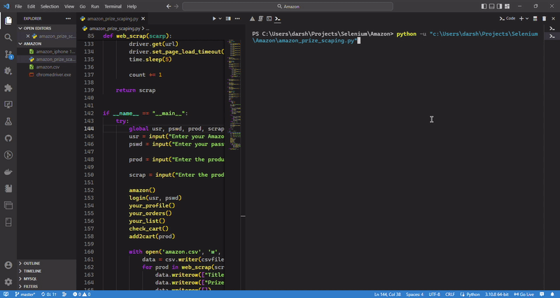

# `Selenium Automation of Amazon using Python`

## `Contents`

- [`Selenium Automation of Amazon using Python`](#selenium-automation-of-amazon-using-python)
  - [`Contents`](#contents)
  - [`Introduction`](#introduction)
  - [`Credentials Demo`](#credentials-demo)
  - [`Automation Demo`](#automation-demo)
  - [`Developer`](#developer)

## `Introduction`
  
* Automating of Amazon website by selenium using python.
* Login into the Amazon account by providing credentials
* Checking the *Profile*
* Checking into the *Your Orders* section
* Checking into *Your Wishlist* section
* Searching any product that you wanted to add to *Your Cart*.
* Checking the *Your Cart*
* Finally, *Web Scraping* to get a list of information about any product you want to buy with its name and prize of the product
* The web scrapped data will be stored in **amazon.csv** file.

## `Credentials Demo`

## `Automation Demo`

## `Developer`

|[Pruthvi Darshan S S]()|
|-----------------------|
||